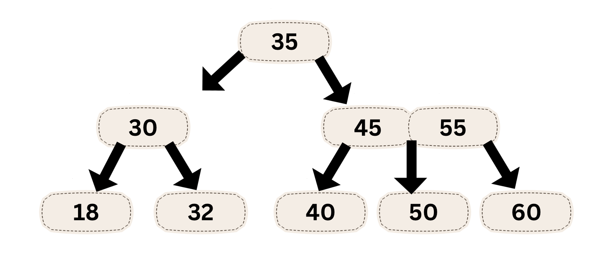

# Basics

Ruby's basic syntax is clean and intuitive. Let's explore some fundamental concepts:

## Variables and Data Types

Variables in Ruby don't need explicit declaration - they're created when you first assign a value:

```ruby
some_variable = 'test'
```


